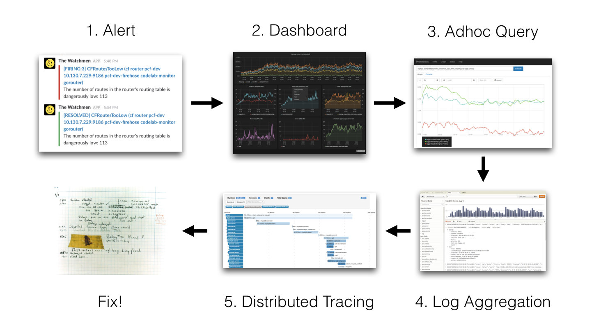

# [OpenTelemetry](https://opentelemetry.io/)

An observability framework for cloud-native software.

OpenTelemetry is a collection of tools, APIs, and SDKs. You can use it to instrument, generate, collect, and export telemetry data (metrics, logs, and traces) for analysis in order to understand your software's performance and behavior.

Telemetry:遥测，可观察性

OpenTelemetry，云原生软件的可观察性框架

<iframe width="560" height="315" src="https://www.youtube.com/embed/X8w4yCmAMos" title="YouTube video player" frameborder="0" allow="accelerometer; autoplay; clipboard-write; encrypted-media; gyroscope; picture-in-picture" allowfullscreen></iframe>

# [Cloud Native](https://cloudnative.to/)
The CNCF ( Cloud Native Computing Foundation ) Cloud Native [Definition v1.0 says](https://github.com/cncf/foundation/blob/master/charter.md):

*Cloud native technologies empower organizations to build and run scalable applications in modern, dynamic environments such as public, private, and hybrid clouds. Containers, service meshes, microservices, immutable infrastructure, and declarative APIs exemplify this approach.*

*These techniques enable loosely coupled systems that are resilient, manageable, and observable. Combined with robust automation, they allow engineers to make high-impact changes frequently and predictably with minimal toil.*

云原生带来的不仅仅是应用部署能够部署云上而已，其整个的定义是一套新的 IT 系统架构升级，包括开发模式、系统架构、部署模式、基础设施全套的演进和迭代

 

# [Observability](https://en.wikipedia.org/wiki/Observability) 

The concept of observability was introduced by Hungarian-American engineer Rudolf E. Kálmán for linear dynamic systems.

Observability is a measure of how well internal states of a system can be inferred from knowledge of its external outputs.

复杂系统的可观察性，可以帮助了解系统内部的运行状态，以便更好进行监控和问题修复

# Observability in IT

Peter Bourgon 在参加完 2017 Distributed Tracing Summit 后发表的一篇[博文](https://peter.bourgon.org/blog/2017/02/21/metrics-tracing-and-logging.html)，简洁扼要地介绍了 Metrics、Tracing、Logging 三者的定义和关系

* Metrics：Zabbix、Nagios、Prometheus、InfluxDB、OpenFalcon、OpenCensus
* Tracing：Jaeger、Zipkin、SkyWalking、OpenTracing、OpenCensus
* Logging：ELK、Splunk、SumoLogic、Loki、Loggly

# 现状

## 1. logs

[详细介绍](https://cloud.tencent.com/developer/article/1758278)

## 2. trace

[Dapper](https://bigbully.github.io/Dapper-translation/)

## 3. Metrics

## 4. 使用

# 出世

## [OpenTracing](https://www.servicemesher.com/istio-handbook/practice/opentracing.html)
OpenTracing制定了一套平台无关、厂商无关的协议标准，使得开发人员能够方便的添加或更换底层APM的实现，背后的老板是CNCF。遵循OpenTracing协议的产品有Jaeger、Zipkin等等。
## OpenCensus
OpenCensus的最初目标并不是抢OpenTracing的饭碗，而是为了把Go语言的Metrics采集、链路跟踪与Go语言自带的profile工具打通，统一用户的使用方式。随着项目的进展，野心也膨胀开始幻想为把其它各种语言的相关采集都统一，背后老板是google和微软。
## 比较

可以看到，OpenTracing和OpenCensus从功能和特性上来看，各有优缺点。OpenTracing支持的语言更多、相对对其他系统的耦合性要更低；OpenCensus支持Metrics、分布式跟踪,同时从API层一直到基础设施层都进行了支持。
## Opentelemetry

The OpenTelemetry project solves these problems by providing a single, vendor-agnostic solution.
## architecture

OpenTelemetry provides you with:

* A single, vendor-agnostic instrumentation library per language with support for both automatic and manual instrumentation.
* A single collector binary that can be deployed in a variety of ways including as an agent or gateway.
* An end-to-end implementation to generate, emit, collect, process and export telemetry data.
* Full control of your data with the ability to send data to multiple destinations in parallel through configuration.
* Open-standard semantic conventions to ensure vendor-agnostic data collection
* The ability to support multiple context propagation formats in parallel to assist with migrating as standards evolve.
* A path forward no matter where you are on your observability journey. With support for a variety of open-source and commercial protocols, format and context propagation mechanisms as well as providing shims to the OpenTracing and OpenCensus projects, it is easy to adopt OpenTelemetry.

## [Components](https://opentelemetry.io/docs/concepts/components/)

* Proto
* Specification
* Collector
* Instrumentation Libraries
  
## Collector

# 天机阁
https://km.woa.com/articles/show/483131?kmref=search&from_page=1&no=1

参考:
* https://opentelemetry.io/
* https://jimmysong.io/kubernetes-handbook/cloud-native/kubernetes-and-cloud-native-app-overview.html
* https://bigbully.github.io/Dapper-translation/
* https://github.com/open-telemetry/docs-cn/blob/main/OT.md
* https://newrelic.com/blog/best-practices/opentelemetry-opentracing-opencensus
* https://wu-sheng.gitbooks.io/opentracing-io/content/
* https://www.instana.com/blog/observability-vs-monitoring/